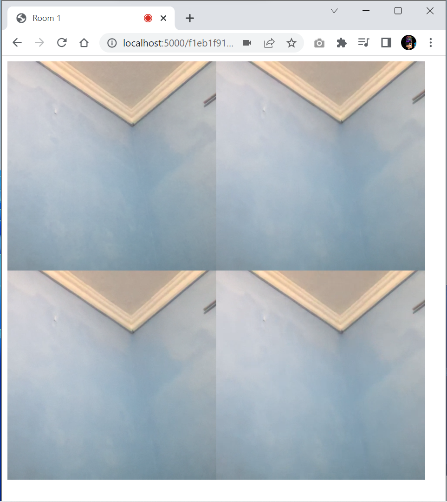

# Peer to Peer Video Call

This is simple repo to enable a peer to peer video call between users.

## Features

- Peer-to-peer video calling: Users can establish direct video connections with each other, eliminating the need for intermediaries.

- Simple implementation: The code is designed to be easy to understand and modify, making it accessible for developers of different skill levels.

- Minimal dependencies: The project utilizes lightweight libraries to minimize external dependencies and simplify setup.

- Cross-platform compatibility: The code can be executed on various operating systems and web browsers, ensuring broad compatibility.

## Installation
<details>
<summary>
  <code>There are several ways to save this repository on your device. Two of these options include:</code>
</summary>

- [Downloading repository as ZIP](https://github.com/carrot2803/P2P-Video-Call/archive/refs/heads/master.zip)
- Running the following command in a terminal, provided the [GitHub CLI](https://cli.github.com/) has been previously installed:
```sh
git clone https://github.com/carrot2803/P2P-Video-Call.git
```

<code>Install dependencies and run:  </code>

Run the following command to install the required dependencies:
```sh
npm i
```
Run the app: Connect your device or emulator, and run the following command to launch the app:
```sh
npm run devStart
```
</details>

## Usage

1. Open the project in a web browser by accessing the local development server or the hosted version.

2. Grant the necessary permissions to access your camera and microphone when prompted.

3. Share the URL of the web application with the person you want to communicate with.

## Snippets

<br/>
